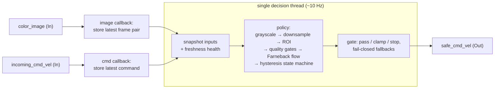
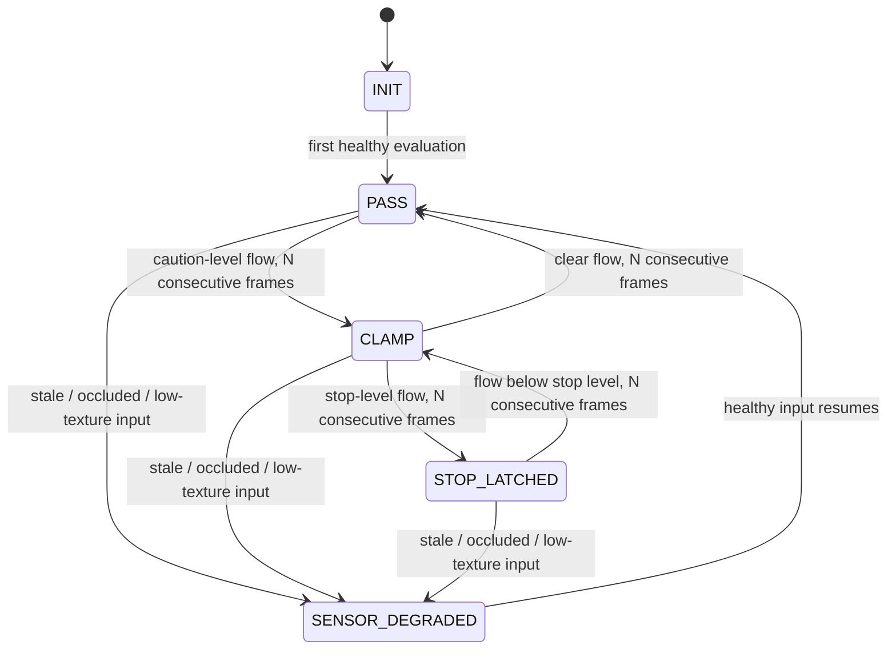

# RGB Collision Guardrail

A safety layer for mobile robots that sits on the operating system side (DimOS) between whatever produces motion commands (a person-follower, a nav stack, teleop) and the robot's motors, and vets each command against a single RGB camera before it goes out. If the camera shows a likely frontal collision it **clamps** or **stops** forward motion; otherwise the command **passes** through untouched. CPU-only, 10 Hz.

Built as a contribution to [dimOS](https://github.com/dimensionalOS/dimos), an open-source robotics OS, and proposed upstream in [dimensionalOS/dimos#1748](https://github.com/dimensionalOS/dimos/pull/1748).

> **Note on running this repo:** these files are extracted from my dimOS branch and target dimOS's module/stream runtime (`dimos.core`, `dimos.msgs`), which isn't vendored here. This is a *code-reading* repo — the design, the safety reasoning, and the tests are the artifact. The PR link above shows it in its native context.

---

## Architecture

Two layers with a deliberate seam between them:



- **[`rgb_collision_guardrail.py`](dimos/control/safety/rgb_collision_guardrail.py)** — the module shell: stream I/O, freshness checks, scheduling, publishing. Callbacks only store the latest input; all decisions run on one thread (why, in [Design decisions](#design-decisions-worth-reading-the-code-for)).
- **[`guardrail_policy.py`](dimos/control/safety/guardrail_policy.py)** — the collision detector behind a small `Protocol`: takes a frame pair, returns a decision. Optical flow in v1; that seam is the first design decision below.

### The state machine



| State | Output on `safe_cmd_vel` |
|---|---|
| `PASS` | Upstream command, unmodified |
| `CLAMP` | Forward speed capped (default 0.1 m/s); angular preserved |
| `STOP_LATCHED` | `linear.x = 0`; angular preserved so the operator can steer away |
| `INIT` / `SENSOR_DEGRADED` | Zero twist — fail closed |

### Design decisions

General systems-design calls with the camera and the robot as the setting where they're applied.

- **The detector is swappable; the runtime around it is fixed.** Two files, one method between them. [`guardrail_policy.py`](dimos/control/safety/guardrail_policy.py) is the detector: give it a frame pair and it decides pass / clamp / stop — the optical flow, the quality gates, and the hysteresis that stops the verdict from flickering all live here. [`rgb_collision_guardrail.py`](dimos/control/safety/rgb_collision_guardrail.py) is the runtime: stream I/O, the thread, when to evaluate, input-freshness, fail-closed fallbacks, and publishing. They meet only at [`GuardrailPolicy.evaluate`](dimos/control/safety/guardrail_policy.py#L83). Swap the detector — optical flow today, a learned depth model tomorrow — and the runtime doesn't change a line.

- **Image frames and commands run on separate clocks, so any upstream rate works.** Risk is re-evaluated only when a new camera frame arrives, capped at a fixed rate and independent of how fast commands come in. Each command is just checked against the latest risk verdict and sent on. *Faster than 10 Hz:* commands reuse the standing verdict instead of forcing extra computation. *Slower than 10 Hz:* each command still gets a fresh verdict, because evaluation never waited on it. *Stopped sending mid-stop:* a heartbeat keeps re-sending the safe output, so downstream doesn't drift back to the last command it heard.
- **One thread makes every decision.** The output drives one motor, so only one command can ever be in effect — a natural single-owner resource, and a single writer matches it exactly. Nothing pushes back on that: one optical-flow pass at 10 Hz fits comfortably on one core, so a second thread would add coordination (locks, ordering, the chance of two paths racing to issue conflicting commands) to buy throughput the workload doesn't need. What the single thread buys instead is a control path that's one straight line from input to output — the kind you can read top to bottom and be sure of. For code whose bugs move a robot, that certainty is worth more than parallelism.
- **The expensive work runs outside the lock.** The worker copies the inputs under a short lock, then runs optical flow without holding it, so a slow frame never blocks the camera or command callbacks ([`_decision_loop`](dimos/control/safety/rgb_collision_guardrail.py#L244-L311)).

## The brief

Everything above came from a spec that was one sentence long:

> *"Build a collision guardrail that takes only RGB images as input and runs at 10 Hz."*

No depth sensor, no prior robotics background, no familiarity with the codebase. The hard part wasn't the computer vision — it was turning that one sentence into decisions I could defend. Each row is a question the brief left open and the answer I chose:

| Ambiguity in the brief | What I decided, and why |
|---|---|
| Where does it live in the OS? | A generic control-layer module that doesn't care what's upstream. The person-follow skill was the first thing to use it, not the reason it was shaped the way it is. |
| What can RGB alone actually tell you? | No depth means no direct distance. Optical-flow magnitude in a forward region of interest is a cheap, classical proxy for "something is looming." And because RGB lies (dark rooms, blocked lens, blank walls), the module needs *image-quality gates* that refuse to trust unusable frames. |
| What does 10 Hz constrain? | A per-frame compute budget. Frames are downsampled to 160 px width and cropped to the forward ROI before flow runs, keeping the hot path small enough for CPU. |
| What *is* a guardrail here? | An inline command gate — a man-in-the-middle on `cmd_vel` that owns the last word on what reaches the base. Not an advisory signal someone else has to remember to check. |
| What happens when inputs go wrong? | Fail closed, always. Input can be bad in three ways — never arrived, arrived but stale, arrived but unusable — and each one maps to a named state that outputs zero velocity. |
| How should a stop *feel*? | Latched with hysteresis. A safety gate that flickers between stop and go on noisy single frames is worse than useless — release requires consecutive clear frames. Stops zero `linear.x` but preserve angular terms, so an operator can still steer out of trouble. |

## Testing

The suite (three files, shared helpers in [`test_utils.py`](dimos/control/safety/test_utils.py)) exercises the module through fake transports and injected policies rather than mocks of the framework:

- **Policy-level**: deadband passthrough, quality-gate fail-closes, and the full hysteresis ladder (caution → clamp → stop → latched release) as frame-by-frame state sequences.
- **Module-level**: every fail-closed fallback, policy-exception containment, and decision reuse under command bursts (risk evaluated at its own rate while commands stream through at 100 Hz).
- **Integration-level**: end-to-end wiring, heartbeat republish timing, and a concurrency test that hammers the module with racing image/command threads and asserts a latched stop **never leaks a positive forward velocity** — the invariant that actually matters.

## Repo map

```
dimos/control/safety/
├── rgb_collision_guardrail.py                  # module: I/O, scheduling, freshness, fail-closed gating
├── guardrail_policy.py                         # policy: optical flow + hysteresis state machine
├── test_guardrail_policy.py                    # policy unit tests
├── test_rgb_collision_guardrail.py             # module unit tests
├── test_rgb_collision_guardrail_integration.py # end-to-end + concurrency tests
└── test_utils.py                               # fake transports, synthetic frames, shared helpers
```
