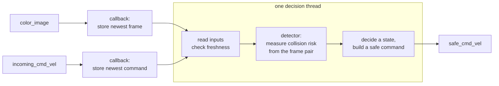

# RGB Collision Guardrail

[](https://github.com/pmg5408/dimos-collision-guardrail/actions/workflows/ci.yml)

A safety gate that sits on a mobile robot's motion-command stream. Whatever produces the
commands (a navigation stack, a person-follower, a human on a joystick) sends them here
first. The guardrail checks each one against a single RGB camera, then either passes it
through, slows it down, or stops forward motion. No depth sensor, no GPU, roughly 10 Hz
on one CPU core.

## Where this came from

I wrote this as a contribution to [dimOS](https://github.com/dimensionalOS/dimos), an
open-source robotics OS, and opened it upstream as
[PR #1748](https://github.com/dimensionalOS/dimos/pull/1748). Since the work added new
files rather than changing existing ones, I pulled those files into this repo and
rebuilt it as a standalone project: local stubs of the two dimOS interfaces it depends
on, and a runnable demo. Coming back to it after several months, a fair amount of it
wanted redesigning, and most of the structure described below is the result of that
second pass rather than the original draft.

The stubs stand in for the dimOS runtime so the code runs on its own. They are a
harness, not a reimplementation of dimOS.

## How it works

The images and the motion commands are produced elsewhere and pushed into the guardrail by
calling into it. Whichever thread makes that call does not belong to us, so it has to be
handed straight back. Running a vision pass inside that call would stall the camera driver
or the code producing the commands, for the same reason you never do heavy work on a UI
thread or inside an event loop.

So the two callbacks do the least they can: save the newest value, flag that there is work
waiting, and return. A worker thread picks it up from there and does everything else (callback offload).


```mermaid
flowchart LR
    CAM["color_image"] --> CB1["callback:<br/>store newest frame"]
    NAV["incoming_cmd_vel"] --> CB2["callback:<br/>store newest command"]
    CB1 --> SNAP
    CB2 --> SNAP
    subgraph WORKER["one decision thread"]
        SNAP["read inputs<br/>check freshness"] --> DET["detector:<br/>measure collision risk<br/>from the frame pair"]
        DET --> GATE["decide a state,<br/>build a safe command"]
    end
    GATE --> OUT["safe_cmd_vel"]
```

Two useful things fall out of that split. The worker is the only thing that writes to the
output, making it the single source of truth for the output motion commands. And because the
callbacks overwrite rather than append, work cannot pile up: if the worker is busy, a newer
frame replaces the one still waiting for it.

Shutting down is the one exception where the thread calling `stop()` publishes a zero of
its own, after the worker's last publish, so the robot is left stationary rather than 
the worker's publish being the last one. Just in this scenario, there are two threads 
writing one stream, so a lock keeps them in order and guarantees the zero is the last thing sent.

The worker wakes whenever an input arrives, so the output keeps pace with whatever rate the
sender is producing, and it wakes at least `min_publish_hz` times a second even when
nothing arrives. So if the command producer stops sending, the last command goes stale and
the guardrail publishes zero velocity of its own accord rather than letting the robot coast
on an old instruction.

Risk is only re-measured when a genuinely new pair of frames is waiting. A command stream
running faster than the camera reuses the standing verdict instead of forcing extra
vision work on camera input that has already been processed.

## What it does when it sees something

| State | What goes out on `safe_cmd_vel` |
|---|---|
| `PASS` | The upstream command, untouched |
| `CLAMP` | Forward speed capped, turning preserved |
| `STOP_LATCHED` | Forward speed zeroed, turning preserved so an operator can steer away |
| `SENSOR_DEGRADED` | Zero velocity |
| `INIT` | Zero velocity |

Those first three states form a sequence, and the guardrail moves through it
asymmetrically: tightening is quick, loosening is slow. Anything the
guardrail cannot trust puts it in `SENSOR_DEGRADED` instead.

## Swapping the detector

The detector is the piece most likely to be thrown away and rewritten as better approaches
turn up, so it is the only piece put behind an interface. Adding a new way of judging risk
means writing one class containing the computation for that judgement and nothing else.
There is no glue to write: no threading, no freshness handling, no registration wiring. The
class declares a name for itself and becomes selectable from configuration, so any number of
detectors can live in the repo at once.

Two detectors are shipped here:

```python
RGBCollisionGuardrail(policy={"kind": "optical_flow"})      # Farneback flow magnitude
RGBCollisionGuardrail(policy={"kind": "frame_difference"})  # mean intensity change
```

## Running it

```bash
python -m venv .venv && source .venv/bin/activate
pip install -e ".[dev]"
python examples/demo.py
```

The demo feeds synthetic frames through the real module. Apparent motion climbs, holds,
then settles back to a crawl:

```
step  shift  state           reason                   out m/s
-------------------------------------------------------------
   0   0.25  init            waiting_for_frame_pair      0.00
   1   0.25  pass            risk_clear                  0.40
   2   1.00  pass            risk_clear                  0.40
   3   1.00  clamp           risk_clamp                  0.10
   4   1.00  clamp           risk_clamp                  0.10
   5   3.00  clamp           risk_clamp                  0.10
   6   3.00  stop_latched    risk_stop                   0.00
   7   3.00  stop_latched    risk_stop                   0.00
   8   0.25  stop_latched    risk_stop                   0.00
   9   0.25  clamp           risk_recovery               0.10
  10   0.25  pass            risk_clear                  0.40
  11   0.25  pass            risk_clear                  0.40
  12   0.25  pass            risk_clear                  0.40

final published command: 0.00 m/s (zeroed on stop)
```

## Repo map

```
dimos/control/safety/
├── rgb_collision_guardrail.py   # threading, freshness, fail-closed, publishing
├── guardrail_policy.py          # the detector interface
├── guardrail_hysteresis.py      # turns a run of readings into a state
├── guardrail_types.py           # shared vocabulary
└── policies/                    # the detectors
    ├── _roi_detector.py         # shared preprocessing and quality gates
    ├── optical_flow.py
    └── frame_difference.py

dimos/{core,msgs,utils}/         # local stubs of the dimOS runtime
examples/demo.py                 # the run above
```

## Design notes

- **Fail closed by default.** Bad input, missing input, or a crashing detector all
  produce zero velocity with a named reason. There is no path where uncertainty results
  in motion.
- **The structural work is written once; the replaceable part is a leaf.** Threads, timing,
  input validation, and failure behaviour all live in the runtime and are indifferent to
  which detector is plugged in. A detector is one class and one method, with no knowledge of
  how it will be scheduled or what happens to its answer. So the two halves change
  independently, and the hard-won part does not get destabilised every time the easy part is
  replaced.
- **Expensive work runs outside the lock.** The worker copies what it needs under a short
  lock and then runs the vision pass without holding it. The thread handoff keeps slow work
  off the producer's thread; this keeps it from blocking the other callback too.
